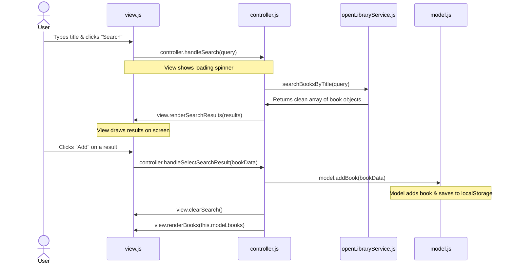

# A Guide for those lost in the JavaScript forrest of this App

Hey everyone. If you are reading this, you are probably looking at this project and feeling your chest tighten up a bit. I get it. I’ve only had one class in HTML and CSS, and I’m in my second term of JavaScript. Last term, JS was basically just doing `alert("Hello World")`, changing a background color with a button, and writing simple `if/else` statements. 

Then you open this folder and... BAM! Five different JavaScript files, things called "controllers" and "models," `import` and `export` statements everywhere, and a testing directory? I honestly wanted to close my laptop and pretend this class didn't exist.

But after staring at the screen, drinking way too much coffee, and asking the instructor a million questions, I finally mapped out this forest. I wrote this guide to be the map I wish I had when I first opened this project. Let's get through this together.

---

## 🗺️ The Forest Map: Why are there so many files?

In our first term, we did what I call "spaghetti coding." We threw our HTML, CSS, and JS all into one or two files. It worked, but once the app got bigger, finding a bug was like looking for a needle in a haystack.

This app uses an architecture called **MVC (Model-View-Controller)**. Don't let the name scare you. It just means we divide the work so nobody gets overwhelmed:

1. **The Model** is the **Brain** (remembers the data).
2. **The View** is the **Face/Hands** (draws the HTML and senses user clicks).
3. **The Controller** is the **Traffic Cop** (tells the view what to show and the model what to remember).

Here is a map of the trees in our forest:

```
BookList/
├── index.html                  <-- The bare skeleton (almost empty HTML)
└── src/
    ├── css/
    │   └── styles.css          <-- Standard custom styles (styling our tree)
    └── js/
        ├── index.js            <-- The Ignition Switch (starts the app)
        ├── openLibraryService.js <-- The Mail Carrier (goes to the internet to get books)
        ├── model.js            <-- The Vault (stores and updates books in localStorage)
        ├── view.js             <-- The Screen (draws HTML using templates)
        └── controller.js       <-- The Boss / Traffic Cop (coordinates everything)
```

---

## 🌲 Tree by Tree: Breaking Down the Files

Let's walk through each file and look at what it actually does in plain English.

### 1. `index.html` (The Stage)
If you open [index.html](file:///Volumes/DataCard/Repos/CS233JS-Repos/CS233JS-CourseMaterials/Examples/BookList/index.html), you'll notice it is surprisingly short! There are no books listed there. It is basically just:
* Some Bootstrap container classes (so it looks pretty and doesn't take 200 lines of custom CSS).
* Empty placeholders like `<ul id="bookListContainer"></ul>` and `<div id="searchResults"></div>`.
* A single `<script>` tag at the bottom that imports `/src/js/index.js` as a `module`.
* **TL;DR:** HTML is just the empty stage. The JS script is going to act like the crew setting up the props dynamically.

### 2. `src/js/index.js` (The Ignition Switch)
This is the entry point. When the browser finishes loading the HTML, it runs [index.js](file:///Volumes/DataCard/Repos/CS233JS-Repos/CS233JS-CourseMaterials/Examples/BookList/src/js/index.js).
All it does is:
1. Import Bootstrap CSS and our custom CSS so the browser loads them.
2. Import the classes: `BookModel`, `BookView`, and `BookController`.
3. Wait for the page to load (`DOMContentLoaded`), then create one instance of each:
   ```javascript
   const model = new BookModel();
   const view = new BookView();
   const controller = new BookController(model, view);
   ```
* **Analog analogy:** It’s like turning the key in a car ignition. It connects the battery (model) to the dashboard (view) through the wiring (controller) and starts the engine.

### 3. `src/js/openLibraryService.js` (The Mail Carrier)
This file is responsible for going out to the internet to talk to the **OpenLibrary API**. It uses `async/await` and `fetch()`.
* It has `searchBooksByTitle(title)`. When you give it a title, it fetches raw JSON data from OpenLibrary.
* Because the API sends back a giant, messy mountain of data, this file has another helper function called `parseSearchResults(data)`. This function cleans up that messy data and returns a neat array of objects containing only what we care about: `{ title, author, pubDate, isbn, coverPhotoUrl }`.
* **No DOM allowed:** Notice there is **zero** HTML or DOM stuff here. It doesn't know what a "button" or "div" is. It only knows how to fetch and format data.

### 4. `src/js/model.js` (The Vault)
The Model [model.js](file:///Volumes/DataCard/Repos/CS233JS-Repos/CS233JS-CourseMaterials/Examples/BookList/src/js/model.js) is where all the data lives.
* When it starts up, it reads our books from `localStorage` using `JSON.parse()`.
* It has methods to alter our list of books: `addBook()`, `updateStatus()`, `rateBook()`, and `deleteBook()`.
* Every time it changes the list, it runs `this._commit()`, which saves the new list back to `localStorage` (as a string using `JSON.stringify()`) and tells the app that things changed.
* **Why no DOM?** Just like the service, the Model has **no DOM code**. It doesn't touch the screen. Why? Because it makes it super easy to test! We can run tests on the Model in terminal (using Vitest) without having to spin up a browser.

### 5. `src/js/view.js` (The Screen & Remote Control)
The View [view.js](file:///Volumes/DataCard/Repos/CS233JS-Repos/CS233JS-CourseMaterials/Examples/BookList/src/js/view.js) is the only file allowed to talk to the DOM. If you see `document.getElementById`, `innerHTML`, or `.onclick`, it belongs here!
* It uses **Template Literals** (those backticks `` ` `` with `${}` variables) to build HTML strings dynamically and inject them using `.innerHTML`.
* It has two jobs:
  1. **Draw the UI:** `renderBooks(books)` loops over the list of books, builds the HTML for each row (including the star ratings and status dropdowns), and drops it into `bookListContainer`.
  2. **Listen for clicks:** It listens for button clicks, dropdown changes, and star ratings. But instead of doing the logic itself, it immediately tells the Controller: *"Hey, the user clicked delete on book ID 123. Do something!"*

### 6. `src/js/controller.js` (The Boss / Traffic Cop)
The Controller [controller.js](file:///Volumes/DataCard/Repos/CS233JS-Repos/CS233JS-CourseMaterials/Examples/BookList/src/js/controller.js) is the middleman. It doesn't hold data (Model does that) and it doesn't draw things (View does that). It just tells them what to do.
* When the View gets a click, it tells the Controller: `controller.handleDeleteBook(id)`.
* The Controller tells the Model: `model.deleteBook(id)`.
* The Controller explicitly coordinates everything. After telling the Model to change the data, it immediately tells the View to update the screen: `this.view.renderBooks(this.model.books)`.

---

## ⚡ The Story of a Click: Tracing the Path

Understanding how these files talk to each other is the hardest part. Let’s walk through what happens step-by-step when you search for a book:



1. **User interaction:** You type "The Hobbit" and click **Search**.
2. **View triggers Controller:** The View's `onclick` handler calls `this.controller.handleSearch("The Hobbit")` and shows a loading spinner on the screen.
3. **Controller asks Service:** The Controller calls the service `searchBooksByTitle("The Hobbit")`.
4. **Service calls Internet:** The service fetches the data from OpenLibrary, parses it into nice neat book objects, and returns them to the Controller.
5. **Controller tells View to show results:** The Controller calls `this.view.renderSearchResults(results)`.
6. **User adds the book:** You see the search results and click **Add** next to "The Hobbit".
7. **View tells Controller:** The View senses the click and calls `this.controller.handleSelectSearchResult(selectedBook)`.
8. **Controller tells Model to add:** The Controller calls `this.model.addBook(selectedBook)`.
9. **Model saves:** The Model generates a unique ID for the book, pushes it to its list, and saves it to `localStorage` (`_commit()`).
10. **Controller updates the View:** The Controller manually calls `this.view.clearSearch()` to hide the search results, and then explicitly calls `this.view.renderBooks(this.model.books)` to draw the new list on the screen.

---


## 🚀 Running the App: Vite and local servers

When you want to run this app, you can't just double-click `index.html` in your finder/explorer window. If you do, you'll see a blank page and a console error about "CORS" or "ES Modules".

Modern JavaScript uses `import` and `export` statements. For security reasons, web browsers won't run these modular scripts directly from a local file (`file:///...`). They must be served from a web server (`http://localhost:...`).

That's where **Vite** comes in. Vite is a super-fast tool that spins up a local web server for us.
1. Open your terminal in the `BookList` folder.
2. Run `npm install` (this downloads Bootstrap and Vite into `node_modules`).
3. Run `npm run dev`.
4. Command-click the link it prints (like `http://localhost:5173`) to open it in your browser.

---

## 🧪 Unit Testing: Why Vitest?

In our previous classes, we tested our code by refreshing the browser page, typing in test data, and clicking buttons over and over. It was exhausting.

In this project, we use **Vitest** to run automated unit tests. 
* Look at the `tests` directory. There are files like [model.test.js](file:///Volumes/DataCard/Repos/CS233JS-Repos/CS233JS-CourseMaterials/Examples/BookList/tests/model.test.js).
* These tests are just scripts that run in your terminal. They create a dummy model, call `addBook()`, and assert that the book was actually added.
* Because our `model.js` and `openLibraryService.js` don't have any HTML/DOM code, we can test them in seconds without even opening Chrome!
* You run the tests by typing `npm run test` in your terminal. If they all turn green, you know your logic is solid!

---

## 💡 Quick Tips for Surviving this Lab

* **Keep your console open:** Right-click the browser, click **Inspect**, and go to the **Console** tab. If your app is blank, 99% of the time there is a red error message there telling you exactly what line broke.
* **Watch your template literals:** In `view.js`, inside the backticks, make sure you use `${book.title}` instead of `book.title`. If you forget the `${}`, it will literally print the word "book.title" on your screen.
* **Check local storage:** In Chrome DevTools, go to the **Application** tab, then **Local Storage** on the left. You can see the `booklist_books` key and watch your data update in real time as you click around!

Don't panic. Take it one file at a time. The first time you see MVC, it feels like a maze. But once you trace the flow of a single click, the forest starts to make a lot of sense. You got this! 🌲📚
