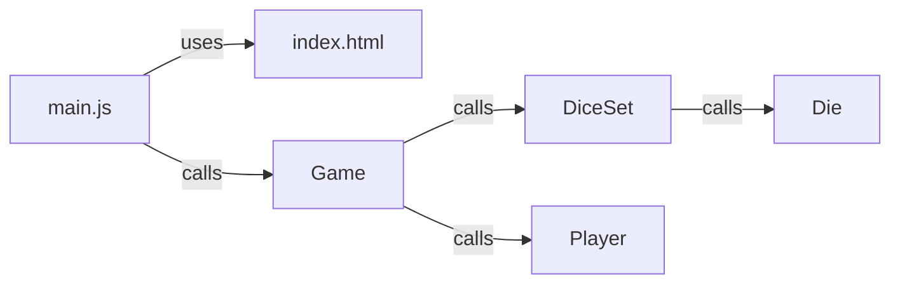

<h1>More About Classes and Object Oriented Programming</h1>

**CS233JS Intermediate Programming: JavaScript**

<h2>Contents</h2>

[TOC]

## Review 

In the last class, you learned how to define classes and create objects. This week you will learn more about OOP (Object Oriented Programming) and how to use classes and objects.

## Object Oriented Programming

OOP is a programming *paradigm* in which programs are designed around *classes* and *objects*. They provide the structural framework for the program.

- Classes are like cookie cutters or templates that we use to make objects.
- Classes often *model* things in the real world or the world of our program.
- The code gets executed (run) is in the objects, not the classes (typically).

### Why use classes?

-  To make code easier to reuse.  

  For example, imagine you are making a dice game. The game uses multiple dice and can have multiple players, so it makes sense to have separate classes for `Die` and `Player`&mdash;then we can make multiple `die` and `player` objects from those classes.

- To group together methods and properties (aka fields) that are related to each other so that code is easier to understand. (The principle of classes being *highly coherent*) .
  
  For example, lets look at an implementation of the dice game ["Ship, Captain, Crew" on GitHub](https://github.com/LCC-CIT/CS233JS-CourseMaterials/tree/main/Labs/Lab03-Classes/ShipCaptainCrew). In this program design, we group methods and  properties together in these classes that *model* things in the game:
  
  - `Die`
  
  - `DiceSet`
  
  - `Player`
  
  - `Game`&mdash;this class will contain the code for managing the game-play logic.
  
- To make refactoring easier by reducing *dependencies*.  

  One of the dependencies that can really complicate our program is the code related to web page i/o (input/output). We can keep that code out of the `Game` class and either put it in a separate, special i/o  class, or just have a separate module (file) containing i/o functions.


### Encapsulation

Last week you learned that putting code into a class is called *encapsulation*. There is more to encapsulation. It also means that the class becomes a boundary that prevents other code from directly accessing the properties inside the class. This is a way of reducing dependencies and makes code easier to refactor. 

#### Access Control

- Properties (fields) are public by default. (The opposite of most other programming languages.)
- Use # to make them private.

For example:

```javascript
class Player
{
    // declare private instance variables
    #name
    #number // player number
    #totalScore
    #roundScore
    #roundsWon

    constructor(name)
    {
        // Initialize instance variables.
        this.#name = name;
        this.#number = 0;
        this.#totalScore = 0;
        this.#roundScore = 0;
        this.#roundsWon = 0;
    }
```


#### getters and setters

If code outside a class needs to access properties inside a class, we create special methods to do that. These special methods use the keywords `get` or `set`  and appear like properties on objects. For example, this is code from inside a`Player` class:

```javascript
// Getters and Setters
    get name() {return this.#name; }
    get number() { return this.#number; }
    get roundScore() { return this.#roundScore; }
    get totalScore() { return this.#totalScore; }
    get roundsWon() { return this.#roundsWon; }

    set number(value) { this.#number = value; }
    set roundScore(value) { this.#roundScore = value; }
    set totalScore(value) { this.#totalScore = value; }
    set roundsWon(value) { this.#roundsWon = value; }
```

Here is code from the `Game` class that accesses the `Player` scores through a setter, on a player object:

```javascript
startNewGame() {
        this.#round = 1;
        this.#currentPlayerIndex = 0;
        for (const player of this.#players) {
            player.totalScore = 0;
            player.roundScore = 0;
            player.roundsWon = 0;
        }
    }
```

Here's the anatomy of a statement that accesses a setter on an object:

 `player.totalScore = 10;`  
        &uarr;              &uarr;                &uarr;  
object   setter name    value to set  

## Example

Let's look further at the Ship, Captain, Crew example.

### Separation of Concerns

*Separation of Concerns* (SoC) is a software design concept in which code is separated into separate modules, each with a specific function. This makes code easier to understand and maintain. It may mean writing more code, but it will make the code easier to work with in the long run.

In this example, the code is separated into six files:

- Presentation Layer. 
  This code is modular; meaning it's in separate files, but not classes.
  - index.html&mdash;only for  HTML (Content and structure).
  - styles.cs&mdash;only for style and layout.
  - main.js&mdash;contains JavaScript code that interacts with the web page: event handler functions and code that reads from or writes to the web page.
    - Functions in this file call methods in the Game object but not the reverse (except event handlers).
    - Event handlers call methods on the Game object, but Game object methods are never used as event handlers.
- Application Logic (game-play logic). 
  This code is object oriented; meaning it's written using classes.
  - Game.js&mdash;the main game-play logic; like a controller.
  - Player.js&mdash; represents a player, keeps track of one player's scores.
  - DiceSet.js&mdash;represents a set of dice.
  - Die.js&mdash;represents a single die, can be rolled keeps track of it's value.

### Dependencies

In a software application there will always be something that depends on (uses) something else:

- Functions or methods that call other functions or methods.
- Modules (files) that use other modules.
- Classes that use objects of other classes.

This isn't a bad thing, but can cause problems when the dependencies get too complex. Things to avoid are:

- Two-way dependencies. For example two class that each use an object of the other class.
- Circular dependencies. Similar to two-way dependencies, but this would involve a longer path of dependency. For example class A uses class B which uses class C which uses class A.
- Large numbers of dependencies. The fewer dependencies a thing has, the better.

#### What Knows About What

Dependencies are about what uses what. Another way of saying this is that dependencies are about what has to know about what. The code in index.js has to know about the HTML code, but not vice-versa. The code in index.js has to know about the Game class, which has to know about the Die and Player classes, but not vice-versa.




- The method and function calls all go in one direction. In this example:
  -  All sequences of calls start with event handler functions in index.js that are triggered by clicking on something on the web page. 
  - The event handlers make calls to methods in the Game object which in turn calls methods in the DiceSet and Player objects. The calls all go in one direction.

- The HTML page doesn't make or get function calls but main.js depends on it because the event handlers and I/O code all reference the web page.
- The method calls to Game, DiceSet, Die, and Player objects include calls to getters and setters.


## Reference

- [Using Classes Guide](https://developer.mozilla.org/en-US/docs/Web/JavaScript/Guide/Using_classes) on MDN

  

------

[](http://creativecommons.org/licenses/by-sa/4.0/) Intermediate JavaScript Lecture Notes by [Brian Bird](https://profbird.dev), written in 2024, revised spring <time>2026</time> are licensed under a [Creative Commons Attribution-ShareAlike 4.0 International License](http://creativecommons.org/licenses/by-sa/4.0/). 

------------