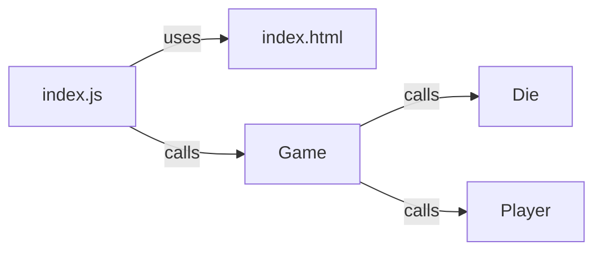

<h1>More About Classes and Object Oriented Programming</h1>

**CS233JS Intermediate Programming: JavaScript**

| Topics by Week                                       |                                                     |
| ---------------------------------------------------- | --------------------------------------------------- |
| 1. Intro to Course, Bootstrap and JavaScript Review  | 6. HTML5 Canvas, CSS Flexbox                        |
| 2. ES6 Classes and Git                               | 7. AJAX, ES6 promises, fetch API                    |
| 3. <mark>More about Classes</mark>                   | 8. Making API calls, graphs and charts, Google maps |
| 4. JS Dev Tools: Node.js, NPM, Webpack, LocalStorage | 9. Term Project                                     |
| 5. Midterm Review and Quiz                           | 10. Review                                          |
| 11. Final Quiz                                       |                                                     |


<h2>Table of Contents</h2>

[TOC]

# Introduction 

Last week you learned how to create ES6 classes. This week you will learn more about OOP (Object Oriented Programming) and why you would want to use classes and objects.

## Review of Card and Die Game Coding Basics

If you would like some review of coding techniques from last term, you can look at the Die Roller web app example:

- Die Roller running on citstudent: https://citstudent.lanecc.edu/~brianb/CS233JS/Examples/DieRoller/
- Die Roller code on GitHub: https://github.com/LCC-CIT/CS233JS-CourseMaterials/tree/main/Examples/DiceExamples


# Object Oriented

#  Programming

Last week you learned how to create ES6 classes. This week you will learn more about OOP (Object Oriented Programming) and why you would want to use classes and objects. We will be looking at a web app for playing the dice game  [Bunco](https://en.wikipedia.org/wiki/Bunco) as an example.

## Why use classes?

-  To make code easier to reuse.  

  For example, imagine you are making a dice game like Bunco. The game uses three dice and can have multiple players, so it makes sense to have separate classes for die and player&mdash;then we can make multiple die and player objects

- To group together methods and variables that are related to eachother so that code is easier to understand.  
  In our Bunco game, we group methods and instace variables together in these classes:

  - Die

  - Player

  - Game&mdash;this class will contain the code for managing the game-play logic.

- To make refactoring easier by reducing dependencies.  

  One of the dependecies that can really complcate our code is the code related to web page i/o (input/output). We can move that code out of the Game class and either put it in a sparate, special i/o  class, or just have a separate file containing i/o functions.


## Encapsulation

Last week you learned that putting code into a class is called *encapsulation*. There is more to encapsulation that just putting code into a class. It also means that the class becomes a boudary that prevents other code from directly using the instance variables inside our class. This is a way of reducing dependencies and makes code easier to refactor. 

#### Access Control

- Instance variables (fields) are public by default. (The opposite of most other programming languages.)
- Use # to make them private.

For example:

```javascript
class Player
{
    // declare private instance variables
    #name
    #number // player number
    #totalScore
    #roundScore
    #roundsWon

    constructor(name)
    {
        // Initialize instance variables.
        this.#name = name;
        this.#number = 0;
        this.#totalScore = 0;
        this.#roundScore = 0;
        this.#roundsWon = 0;
    }
```


#### getters and setters

If code outside a class need to access instance variables inside a class, we create special methods to do that. These special methods use the keywords `get` or `set`  and work like properties when accessed by code outside the class. For example, this is code from inside the `Player` class:

```javascript
// Getters and Setters
    get name() {return this.#name; }
    get number() { return this.#number; }
    get roundScore() { return this.#roundScore; }
    get totalScore() { return this.#totalScore; }
    get roundsWon() { return this.#roundsWon; }

    set number(value) { this.#number = value; }
    set roundScore(value) { this.#roundScore = value; }
    set totalScore(value) { this.#totalScore = value; }
    set roundsWon(value) { this.#roundsWon = value; }
```

Here is code from the `Game` class that accesses the `Player` scores through a setter, on a player object:

```javascript
startNewGame() {
        this.#round = 1;
        this.#currentPlayerIndex = 0;
        for (const player of this.#players) {
            player.totalScore = 0;
            player.roundScore = 0;
            player.roundsWon = 0;
        }
    }
```

Here's the anatomy of a statement that accesses a setter on an object:

 `player.totalScore = 0;`  
        &uarr;              &uarr;                &uarr;  
object   setter name    value to set  

# Example

[Bunco source code on GitHub](https://github.com/LCC-CIT/CS233JS-BuncoGame)

[Bunco running on the citstudent web server](http://citstudent.lanecc.edu/~brianb/CS233JS/Examples//Bunco)

This example illustrates two very important concepts in software design:

- Separation of concerns.
- Minimization of dependencies.

## Separation of Concerns

*Separation of Concerns* (SoC) is a software design concept in which code is spearated into separate modules, each with a specific function. This makes code easier to understand and maintain. It may mean writing more code, but it will make the code easier to work with in the long run.

In this example, the code is separated into six files:

- Presentation Layer. 
  This code is modular; meaning it's in separate files, but not classes.
  - index.html&mdash;only for  HTML
  - styles.cs&mdash;only for style and layout
  - index.js&mdash;contains JavaScript code that ineracts with the web page: event handler functions and code that reads from or writes to the web page.
    - Functions in this file call methods in the Game object but not the revers
    - Event handlers call methods on the Game object, but Game object methods are never used as event handlers
- Application Logic (game-play logic). 
  This code is object oriented; meaning it's written using classes.
  - game.js&mdash;the main game-play logic; like a controller.
  - player.js&mdash; represents a player, keeps track of one player's scores.
  - die.js&mdash;represents a single die, can be rolled keeps track of it's value.

## Dependencies

In a software application there will always be something that depends on (uses) something else:

- Functions or methods that call other functions or methods.
- Modules (files) that use other modules.
- Classes that use objects of other classes.

This isn't a bad thing, but can cause problems when the dependencies get too complex. Things to avoid are:

- Two-way dependencies. For example two classs that each use an object of the other class.
- Circular dependencies. Similar to two-way dependencies, but this would involve a longer path of dependency. For example class A uses class B which uses class C which uses class A.
- Large numbers of dependencies. The fewer dependencies a thing has, the better.

### What Knows About What

Dependencies are about what uses what. Another way of saying this is that dependencies are about what has to know about what. The code in index.js has to know about the HTML code, but not vice-versa. The code in index.js has to know about the Game class, which has to know about the Die and Player classes, but not vice-versa.




- The method and function calls all go in one direction. In this example, all sequences of calls start with event handler functions in index.js that are triggered by clicking on something on the web page. The event handlers make calls to methods in the Game object which in turn calls methods in the Die and Player objects. The calls all go in one direction.
- The HTML page doesn't make or get function calls but index.js depends on it becaue the event handlers and I/O code all reference the web page.
- The method calls to Game, Die, and Player objects include calls to getters and setters.


# Reference

- [Using Classes Guide](https://developer.mozilla.org/en-US/docs/Web/JavaScript/Guide/Using_classes) on MDN

  

------

[](http://creativecommons.org/licenses/by-sa/4.0/) Intermediate JavaScript Lecture Notes by [Brian Bird](https://profbird.dev), written in 2024, revised in <time>2025</time> are licensed under a [Creative Commons Attribution-ShareAlike 4.0 International License](http://creativecommons.org/licenses/by-sa/4.0/). 

------------