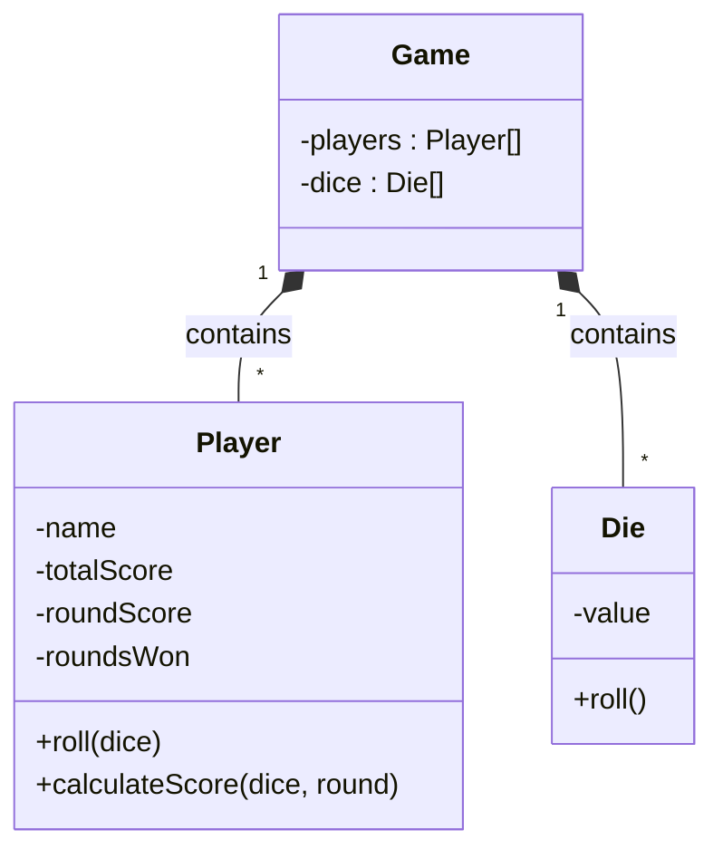

<h1>ES6 Classes</h1>

**CS233JS Intermediate Programming: JavaScript**

| Topics by Week                                        |                                                     |
| ----------------------------------------------------- | --------------------------------------------------- |
| 1. Intro to Course, Bootstrap and JavaScript Review   | 6. HTML5 Canvas, CSS Flexbox                        |
| 2. ES6 Classes and Git                                | 7. AJAX, ES6 promises, fetch API                    |
| 3. <mark>More about Classes</mark> **<== New topic!** | 8. Making API calls, graphs and charts, Google maps |
| 4. JS Dev Tools: Node.js, NPM, Webpack, LocalStorage  | 9. Term Project                                     |
| 5. Midterm Review and Quiz                            | 10. Review                                          |
| 11. Final Quiz                                        |                                                     |

<h2>Table of Contents</h2>

[TOC]

# Introduction

# UML Class Diagram

# Reference

- [Bootstrap 5 Tutorial](https://www.w3schools.com/bootstrap5/)&mdash; W3Schools
- [Official Bootstrap Website](https://getbootstrap.com/)

------

 Intermediate JavaScript Lecture Notes by [Brian Bird](https://profbird.dev), written in <time>2024</time>, are licensed under a [Creative Commons Attribution-ShareAlike 4.0 International License](http://creativecommons.org/licenses/by-sa/4.0/). 

------------