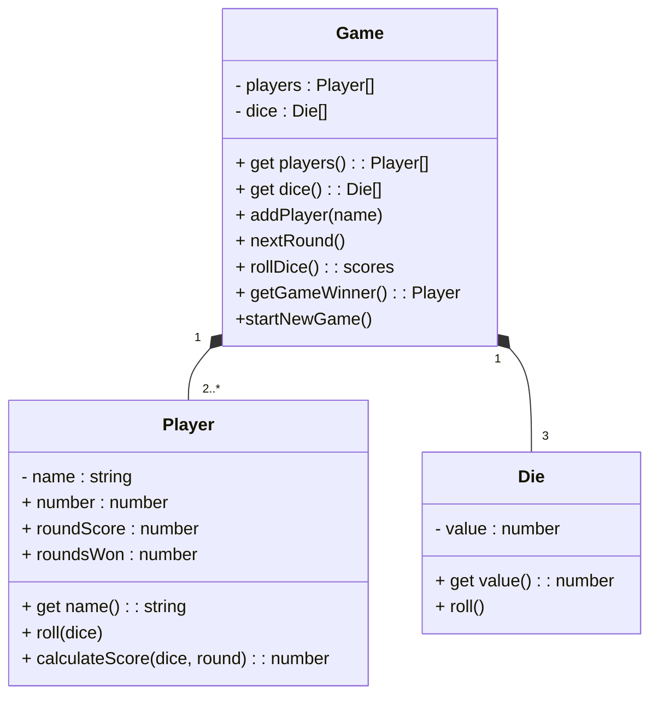

<h1>UML Class Diagrams</h1>

**CS233JS Intermediate Programming: JavaScript**

<h2>Contents</h2>

[TOC]

## Unified Modeling Language

A way to visually represent software design models that is independent of any particular computer language. There are [fourteen types of UML diagrams](https://creately.com/blog/diagrams/uml-diagram-types-examples/). We will just be using [UML class diagram](https://en.wikipedia.org/wiki/Class_diagram).

- Representing classes

  - Name

  - Fields (instance variables)

    - Access modifiers

      &plus; public: can be accessed from outside the class

      &num; protected: can be accessed inside the class and in inherited classes

      &minus; private: can only be accessed inside the class

  - Methods

- Representing relationships

  - Association: arrow
  - Aggregation (equivalent to association): open diamond.
  - Composition: black diamond.
  - Inheritance: triangle.

- Cardinality (multiplicity)

  - Ranges: indicate a range with two dots. For example: 0..n
  - Cardinality relationships
    - One-to-one: put 1 at the end with the diamond.
    - One-to-many: put 1..n at the end with the diamond&mdash;meaning the class with the diamond can have 1 to many instances of the other object.
    - Many-to-many: put diamonds on both ends of the line and put 1..n on both ends. It is good to avoid this relationship since it adds extra complexity.

  

## UML Class Diagram for Bunco

This is the class diagram for a Bunco dice game. The code is available in a [GitHub repository](https://github.com/LCC-CIT/CS233JS-Going2Boston).

### Class Relationships in the Bunco Game

The relationships between classes in this diagram are both *composition*, the "whole-part" relationship.

- The`Game` class contains `Die` objects as parts. 
  This is because `Game` contains an array named `dice` that holds `Die` objects.
- The `Game` contains `Player` objects a parts. 
  This is because `Game` contains an array named `players` that holds `Player` objects.

### Dependencies

`Game` depends on (uses) the` Player` and` Die`, but the `Player` and `Die` don't depend on any classes.  
One way to think about the dependencies is that methods in `Game` call methods in `Player` and `Die`, but not the reverse.

In the full implementation[^1] of the game there is also an index.js file that contains the code that instantiates a Game object and that handles interaction with the web page (index.htm.). Code in index.js calls methods on the game object, but not the reverse.

## References

- Bell, Donald. [The UML 2 class diagram](https://developer.ibm.com/articles/the-class-diagram/) IBM, 2004. Tutorial article.
- Crawley, Gregory. [UML class diagram arrow types: explanations and examples](https://www.gleek.io/blog/class-diagram-arrows.html) Gleek, 2021. Tutorial article with video

------

 Intermediate JavaScript Lecture Notes by [Brian Bird](https://profbird.dev), written in 2024, revised spring <time>2025</time>, are licensed under a [Creative Commons Attribution-ShareAlike 4.0 International License](http://creativecommons.org/licenses/by-sa/4.0/). 

------------

[^1]: Implementation means coding. This is in contrast to designing, which is what you are doing in a UML diagram.

