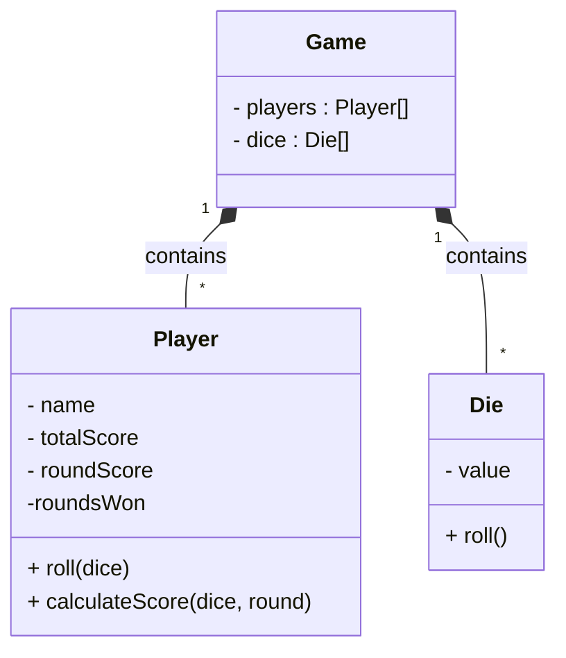

<h1>ES6 Classes</h1>

**CS233JS Intermediate Programming: JavaScript**

| Topics by Week                                        |                                                     |
| ----------------------------------------------------- | --------------------------------------------------- |
| 1. Intro to Course, Bootstrap and JavaScript Review   | 6. HTML5 Canvas, CSS Flexbox                        |
| 2. ES6 Classes and Git                                | 7. AJAX, ES6 promises, fetch API                    |
| 3. <mark>More about Classes</mark> **<== New topic!** | 8. Making API calls, graphs and charts, Google maps |
| 4. JS Dev Tools: Node.js, NPM, Webpack, LocalStorage  | 9. Term Project                                     |
| 5. Midterm Review and Quiz                            | 10. Review                                          |
| 11. Final Quiz                                        |                                                     |

<h2>Table of Contents</h2>

[TOC]

# Unified Modeling Language

A way to visually represent software design models that is independent of any particular computer language. There are [fourteen types of UML diagrams](https://creately.com/blog/diagrams/uml-diagram-types-examples/). We will just be using [UML class diagrams](https://en.wikipedia.org/wiki/Class_diagram).

- Representing classes

  - Name

  - Fields (instance variables)

    - Access modifiers

      &plus; public: can be accessed from outside the class

      &num; protected: can be accessed inside the class and in inherited classes

      &minus; private: can only be accessed inside the class

  - Methods

- Representing relationships

  - Association: arrow
  - Aggregation (equivalent to association): open diamond.
  - Composition: black diamond.
  - Inheritance: triangle.

- Cardinality (multiplicity)

  (In UMLet, m1 indicates the end of the line with the diamond or arrow and m2 indicates the other end.)

  - Ranges: indicate a range with two dots. For example: 0..n
  - Cardinality relationships
    - One-to-one: put 1 at the end with the diamond.
    - One-to-many: put 1..n at the end with the diamond&mdash;meaning the class with the diamond can have 1 to many instances of the other object.
    - Many-to-many: put diamonds on both ends of the line and put 1..n on both ends. It is good to avoid this relationship since it adds extra complexity.

  

# UML Class Diagram for Bunco

# Reference

- Bell, Donald. [The UML 2 class diagram](https://developer.ibm.com/articles/the-class-diagram/) IBM, 2004. Tutorial article.
- Crawley, Gregory. [UML class diagram arrow types: explanations and examples](https://www.gleek.io/blog/class-diagram-arrows.html) Gleek, 2021. Tutorial article with video

------

 Intermediate JavaScript Lecture Notes by [Brian Bird](https://profbird.dev), written in <time>2024</time>, are licensed under a [Creative Commons Attribution-ShareAlike 4.0 International License](http://creativecommons.org/licenses/by-sa/4.0/). 

------------