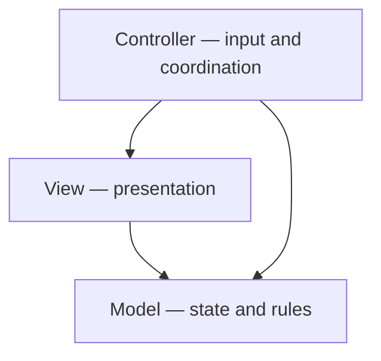

<h1>Notes on the Node Lab</h1>

**CS233JS Intermediate Programming: JavaScript**

<h2>Table of Contents</h2>

[TOC]

## Application Architecture

***Model–View–Controller* (MVC)** splits an interactive app into three roles: the *model* (data and rules), the *view* (presentation — templates, DOM), and the *controller* (handles input, updates the model, refreshes the view). The point is to separate data, UI, and reaction to user actions so each is easier to follow and change.

This lab uses that architecture loosely. A strict MVC implementation would have more to it. 

The diagram below shows dependencies in the MVC architecture: 

- The controller depends on the view and model
- The view depends on the model. 
- The model has no dependencies.

- **View → Model** — the view reads or reflects model state when rendering.
- **Controller → Model** — the controller updates state in response to user actions.
- **Controller → View** — the controller triggers or schedules updates to what the user sees (in a strict textbook MVC, some of this is indirect; in this lab it may be more direct).

## The `lit-html` package

- Look at how the syntax is similar to a template string.
- In the browser's debugger, look at methods in the View class and at what is returned by:
  -  `tasksTemplate` using `html`. 
  -  `displayTasks` using `render`.

- Compare the development and production versions of `lit-html`.
  - See the dev version running on the dev server: message in console, large dependency visible in debugger
  - See the production version by displaying dist/index.html with live server.

## Source Map

- Remove the source map directive from the bundler config file. In the browser, try to debug the code.
- Re-enable the source map and look at the source in the debugger again.

## Size of Bundled Files

- In the example code, look at the size of the node modules used by the web app.

- Look at the size of the source files.
- Compare these to the size of the bundled files in the dist folder.

## Production Code and Deployment

- The dev server keeps the code it built in memory, but doesn't put it in the dist folder.
- `npm run build` builds (bundles and more) the code with output in the dist folder.  
  **Upload just the files inside the dist folder to citstduent!**

- FYI, when pushing to GitHub, the .gitignore file has node_modules listed as a folder to ignore.

## References

- [lit-html documentation](https://lit.dev/docs/templates/overview/)&mdash;Lit website
  - [Using lit-html standalone](https://lit.dev/docs/libraries/standalone-templates/)&mdash;this is what we are using

- [Vite Getting Started Guide](https://vite.dev/guide/)&mdash;Vite website
  - [Vite Build Options](https://vite.dev/config/build-options)

---

 Intermediate JavaScript Lecture Notes by [Brian Bird](https://profbird.dev), written in 2024, updated in <time>2026</time>, are licensed under a [Creative Commons Attribution-ShareAlike 4.0 International License](http://creativecommons.org/licenses/by-sa/4.0/). 