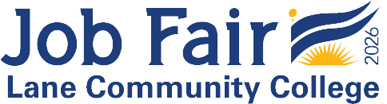

**CS233JS Intermediate Programming: JavaScript**

<h1>Week 8 Overview for Spring 2026</h1>

<h2>May 18 through May 24</h2>

| Topics by Week                                      |                                                            |
| --------------------------------------------------- | ---------------------------------------------------------- |
| 1. Intro to Course, Bootstrap and JavaScript Review | 6. HTML5 canvas                                            |
| 2. Key ES6 Features                                 | 7. Starting the term project                               |
| 3. ES6 classes, OOP and Git                         | <mark>8. Asynchronous programming, calling web APIs</mark> |
| 4. JS Dev Tools: Node.js, NPM, Vite, LocalStorage.  | 9. Unit testing                                            |
| 5. Project Design Midterm quiz                 | 10. Term Project Completion.  Review                  |
| 11. Final quiz                                      |                                                            |

<h2>Contents</h2>

[TOC]

## Announcements

- **LCC Job Fair 2026!**  
      

  The Lane Community College Job Fair will be on Thursday, May 21, from 1 p.m. - 4 p.m. on the 2nd floor of the center building.  [More Information](https://out.smore.com/e/q9cks/xd6j18?__$u__) **| Contact:** [Kirsten Rawding. 

- **Last week to withdraw or change grading options**. This Friday, May 22, is the last day to make schedule changes for this term. This includes dropping a course, withdrawing, or changing grading methods.

  NOTE: You should consult an [advisor](https://www.lanecc.edu/get-support/academic-support/academic-advising) and/or [financial aid](https://www.lanecc.edu/costs-admission/paying-college/financial-aid) representative before making these kinds of changes, especially withdrawing. These types of changes may have implications for academic progress and/or financial aid awards. This is not always the case, but it's best to be informed.

- **Memorial day** is Monday, May 25, there will be no classes.

- **Summer and Fall Term Registration**  
  These are the classes recommended for [Software Devleopment](https://lanecc.smartcatalogiq.com/en/current/lcc-catalog/programs-of-study/computer-information-technology/software-development-aas) majors: 

  **Summer**

  - Required general education courses (if you haven't taken some of these yet):
    - WR 227Z: Technical Writing
    - WR 121Z: Composition 1 
    - MTH 095: Intermediate Algebra 
    - Human Relations: [any courses from this list](https://lanecc.smartcatalogiq.com/en/current/lcc-catalog/programs-of-study/career-technical-education-requirements/human-relations-requirement)  
  - CS 234N: Advanced Programming with C#

  **Fall**

  - Required core courses:
    - CS 212: AI Programming 1
    - CS 295R: Web Development 1: React
    - CS 206 Co-op Ed: Computer Information Technology Seminar

  - Program elective options: 
    - CIS 140U or 240U - Unix/Linux
    - CS 260 Data Structures 1

  - General Education
    - Human Relations

See the [term-by-term sample planner](https://docs.google.com/document/d/1F8CJY1M7A4J9uJtGRDFRyF-0j7l2AVe0vpPE5vcfHXE/edit?tab=t.0) for a listing of the terms courses required for the AAS in Software Development are normally offered.  

- ***All catalog links have been updated to point to the 2026-2027 catalog***
- ***Registration problems with CS 112, CS 212, and CS 213 have been fixed***

## This Week

### Objectives

- To understand how JavaScript promises work.
- To be able to write asynchronous code.
- To use the `fetch` object to call web APIs
- To continue developing your proficiency in  implementing, testing and debugging JavaScript web applications.

### Due dates

- Wednesday, 5/20
  - Reading quiz 6

- Friday, 5/22: 
  - Lab 6 beta version.  
  - Term project UI diagram

- Saturday, 5/23
  - Lab 6 code review.

- Sunday, 5/24:
  - Lab 6 production version.

---

 Intermediate JavaScript course materials by [Brian Bird](https://profbird.dev), written winter 2025, revised spring <time>2026</time>, are licensed under a [Creative Commons Attribution-ShareAlike 4.0 International License](http://creativecommons.org/licenses/by-sa/4.0/). 