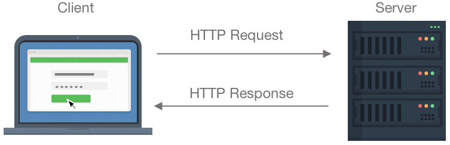

<h1>Working with Web APIs</h1>

**CS233JS Intermediate Programming: JavaScript**

<h2>Contents</h2>

[TOC]

## XHR Calls Revisited

Let's review HTTP requests in general and XMLHttpRequsts (XHRs) in particular.  
**Note**:  when we talk about "XHRs" we mean any HTTP request sent from code. It doesn't matter how the requests are sent; by the JavaScript `XMLHttpRequest` object, or the fetch API or some other way. XHR is not a different protocol from HTTP, it's just another way of sending it.

### Review of the HTTP Protocol

HyperText Transfer Protocol is the standard that describes the way web browsers and web servers communicate over the internet. It is a request-response protocol in which the browser sends a request, in the form of a Uniform Resource Locator (URL), which is often the address of a web page, and the server sends back data, which is often a web page.



​									Image by [Tim DiSabatino](https://www.timdisab.com)

### HTTP Requests

There are multiple HTTP request types[^1]. We are just going to look at GET requests here. A GET request does what it sounds like, it gets data which is returned in an HTTP response. A GET request consists of a web URL with optional query parameters. 

The code for all the following examples can be seen running on [this code demo web page](https://lcc-cit.github.io/CS233JS-CourseMaterials/Examples/XHR_Demo/index.html). On the code demo page:

- View the source in the browser.

- Open the browser's console to see log messages.

  - Try to predict the order in which the log messages will appear.
  - Change the server address in the URL to see if that error is caught.
  - Change the file name in the URL to see if that error is caught.

- Open the browser's network tab to see all requests and responses.

  - Is there any difference between an HTTP request sent from HTML and an XHR?


#### HTTP Requests in HTML

These are some HTML elements that generate HTTP requests:

#### `<a>` Element

A simple link (anchor element) can GET a web page from a remote server:
```html
https://citstudent.lanecc.edu/~brianb/southindia/index.htm
```
#### `<Embed>` Element
We can also GET text from a file on a remote server and embed it in our web page:

```html
<embed type="text/html" src="https://citstudent.lanecc.edu/~brianb/CS233JS/Examples/GhandiQuote.txt"  width="500" height="200>
```

#### `<input type="submit">`  Submit Button on a Form

By default this will send a POST request.

```html
<form action="/action_page.php">
  <!-- form elements for user input -->
  <input type="submit" value="Submit">
</form> 
```


#### HTTP Requests from JavaScript

In order to do something with an HTTP response, other than show it on a web page, we need a way to make a request using code so that we can put the response into a variable or act on it in some way . 

##### `XMLHttpRequest` Object

This example uses the `XMLHttpRequst` object to make a *synchronous* HTTP request.  

Note that `XMLHttpRequest.open` can also be used to make *asynchronous* requests if the last argument is set to `true` and a call-back function is provided.

**HTML**

```html
<p class="quote" id="quote"></p>
```

**JavaScript**

This code uses an XMLHttpRequest object (not the fetch API).

```javascript
let request = new XMLHttpRequest();
  request.open("GET", 'https://lcc-cit.github.io/CS233JS-CourseMaterials/Examples/XHR_Demo/GhandiQuote.txt', false); 
  request.send(null);

  if (request.status === 200) {
      document.getElementById('quote1').innerHTML = request.responseText;
  }
```

##### `fetch` API with Fluent Syntax
Here is an *asynchronous* request using `fetch` that gets the contents of a text file and displays it on the page. This code uses *fluent syntax* (aka method chaining), meaning that the `then` methods are called on `Promise` objects returned by the `fetch` and `then` methods. The `Promise` objects are not visible in the code, although they are still there "behind the scenes".

```javascript
fetch('https://lcc-cit.github.io/CS233JS-CourseMaterials/Examples/XHR_Demo/GhandiQuote.txt')
  .then(response => {
      if (!response.ok) {
          throw new Error("HTTP error " + response.status);
      }
      return response.text();
  })
  .then(text => {
      document.getElementById('quote').innerHTML = text;
  })
  .catch(function () {
 		console.log('An error occurred');
  });
```

##### `fetch` Method with Procedural Syntax

Here is the same *asynchronous* request using `fetch`, but in this code the `Promise` objects returned by the  `fetch` and `then` methods are assigned to variables before being used, so they are "visible" in the code.

```JavaScript
const fetchPromise = fetch('https://lcc-cit.github.io/CS233JS-CourseMaterials/Examples/XHR_Demo/GhandiQuote.txt');

const responsePromise = fetchPromise.then(response => {
    if (!response.ok) {
        throw new Error("HTTP error " + response.status);
    }
    return response.text();
});

responsePromise.then(text => {
    document.getElementById('quote').innerHTML = text;
});

responsePromise.catch(function () {
   console.log('An error occurred');
});
```


#### Example Web Page

This web page has code that makes HTTP requests using both HTML and JavaScript.

[HTTP Request Demo Page](https://lcc-cit.github.io/CS233JS-CourseMaterials/Examples/XHR_Demo/index.html)


## More Dev Tools

These are used in this week's lab.

### JSON Server

Q: How is this different from the webpack dev server?

### DotEnv

GitDefender alert about web api key.

Store api key in environment variables.

#### Webpack Define Plugin

The `webpack.config.js` file for this project has this in the `plugins` section:

```json
/* app uses global SERVER_URL rather than process.env.SERVER_URL */
new webpack.DefinePlugin({
  NODE_ENV: JSON.stringify(process.env.NODE_ENV),
  SERVER_URL: JSON.stringify(process.env.SERVER_URL),
  GMAP_KEY: JSON.stringify(process.env.GMAP_KEY),
})
```

This specifies that webpack's `DefinePlugin` will create global constants based on the values in the `.env` file. 

## Lab 7

### Map API

#### Azure Maps

[Getting Started with Azure Maps](https://learn.microsoft.com/en-us/azure/azure-maps/how-to-manage-account-keys)&mdash;Microsoft Blog Post.

- Requires an [Azure for Students](https://azure.microsoft.com/en-us/free/students) account.
  - Free for 12 months, no credit card required, gives you $100 Azure account credit.
  - Azure is used for other classes in our department.
- 1,000 or more (depending on the type of transaction) free transactions (without using your student Azure credit).

#### Google Maps

- [Getting Started with Google Maps Platform](https://developers.google.com/maps/get-started)&mdash;GCP  Docs.
  - [Add a Google Map with a Marker using JavaScript](https://developers.google.com/maps/documentation/javascript/adding-a-google-map)&mdash;GCP Docs.

- Requires a [GCP (Google Cloud Platform)](https://cloud.google.com) account.

  - 90 day free trial, requires a credit card.
  - Your card could be billed if you use more than $300 in "free" services during the trial period.  
    A notification will be sent if this is about to happen.

  - After the trial period, you get a $200 a month free credit for GCP services, including Google Maps.

## Reference

[Using XMLHttpRequest](https://developer.mozilla.org/en-US/docs/Web/API/XMLHttpRequest_API/Using_XMLHttpRequest)&mdash;MDN

[Get and Post method using Fetch API](https://www.geeksforgeeks.org/get-and-post-method-using-fetch-api/)&mdash;Geeks for Geeks.

[How to Use JSON Server for Front-end Development](https://www.freecodecamp.org/news/json-server-for-frontend-development/)&mdash;Juliet Ofoegbu, Free Code Camp.

[How to Use Node Environment Variables with a DotEnv File for Node.js and npm](https://www.freecodecamp.org/news/how-to-use-node-environment-variables-with-a-dotenv-file-for-node-js-and-npm/)&mdash;Veronica Stork, Free Code Camp.


---

[](http://creativecommons.org/licenses/by-sa/4.0/) Intermediate JavaScript Lecture Notes by [Brian Bird](https://profbird.dev), written in 2024, revised in <time>2025</time> are licensed under a [Creative Commons Attribution-ShareAlike 4.0 International License](http://creativecommons.org/licenses/by-sa/4.0/). 

[^1]: These are all of the HTTP request methods (the first five are the most commonly used): GET, POST, PUT, DELETE, PATCH, HEAD, CONNECT, OPTIONS, TRACE. For details, read [HTTP Request Methods](https://developer.mozilla.org/en-US/docs/Web/HTTP/Methods)&mdash;MDN Reference.